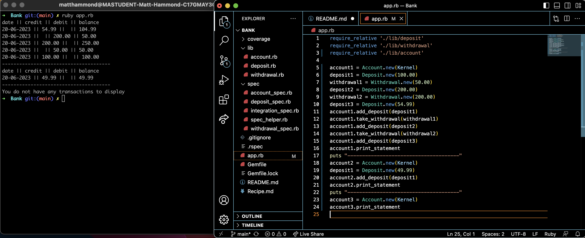
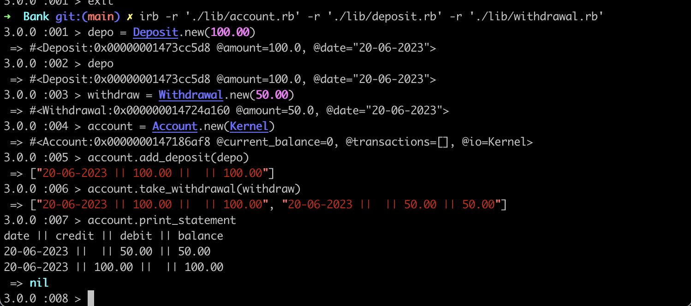

# Matt-West-Bank

## Installation 
Run the below from the command line:

```
git clone https://github.com/MattHammond94/Matt-West-Bank.git
cd Matt-West-Bank
bundle install 
```
You will now be able to run rspec from the command line(rspec has been configured with simplecov) to view the passing tests and test coverage. 

You can also run Rubocop to view offenses(At this stage there are still some 
offenses showing which I would like to investigate further for my own clarity
these can easilly be resolved by running)

Run `rubocop -a` or `rubocop --auto-correct` to auto resolve these offenses.

## Approach 
My approach can be outlined in the file `Recipe.md`
This outlines my approach and how I went from transferring the problem at hand into some basic user stories to then working out the basic class structure and how I would test drive my initial ideas.

## Structure
I seperated my program into 3 different class' - Deposit represents deposit objects used to put money into an account. Withdrawal represents withdrawal objects which are used to take money from an account and the account class controls the incoming and out going of the previous two class'.

Having the withdrawal class inherit from the deposit class allows the two class'
to function the same but be distinguishable from one another. This keeps in line with the Separation of Concerns principle but also allows for future changes/scalability.

The Account class holds the bulk of the methods which can be used to take and manipulate instances of both other class'.

Instances of the Account class need to be initialized with a Kernel object. This was done to test input/output.

## Running the program

To create an instance of each class:

```ruby
deposit = Deposit.new(100.00) => #Ensure instance is initialised with a float value to avoid errors.
withdrawal = Withdrawal.new(59.99) => #Ensure instance is initialised with a float value to avoid errors.
account = Account.new(Kernel) => #account objects take a Kernel object upon creation - This was used to test input and output. 
```

How the class' interact: 

```ruby
deposit = Deposit.new(100.00)
withdrawal = Withdrawal.new(59.99)
account = Account.new(Kernel)
account.add_deposit(deposit)
account.take_withdrawal(withdrawal)
account.print_statement
```

You can open the codebase in your code editor and make changes to the app.rb file as you see fit. You can then run `ruby app.rb` from the command line to view the results as below:



Alternatively the program can be run using IRB by doing the following: 
```
irb -r './lib/account.rb' -r './lib/deposit.rb' -r './lib/withdrawal.rb'
```

